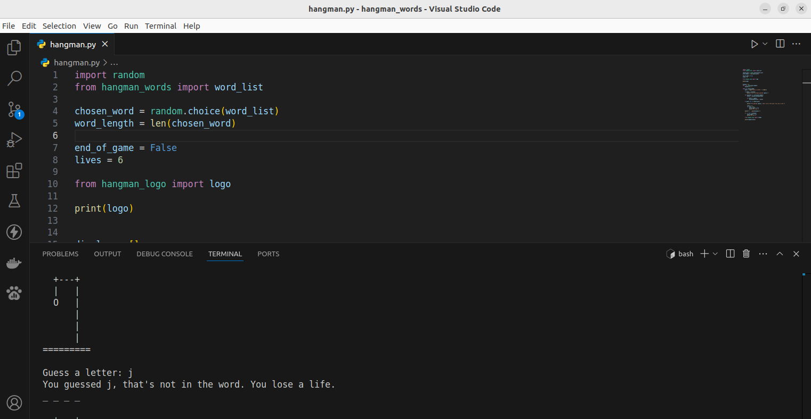

# Hangman Game

## Screenshots

This project is a Hangman Game built with [Python 3](https://www.python.org/downloads/) , where the player guesses letters to uncover a hidden word. The game selects a random word from a predefined list, and the player has a limited number of incorrect guesses before losing. The program displays the word with underscores representing unguessed letters and updates the word as the player makes correct guesses. This project is great for practicing Python concepts like loops, conditionals, string manipulation, and random selection.

## ⚙️ Languages or Frameworks Used:

You only need Python to run this script. You can visit [here](https://www.python.org/downloads/) to download Python.

## 🌟 How to run:

Running the script is simple! Just open a terminal in the folder where your script is located and run the following command:

+ `python3 hangman.py`